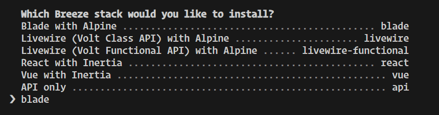
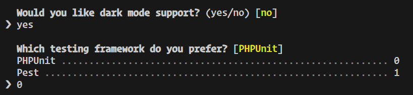
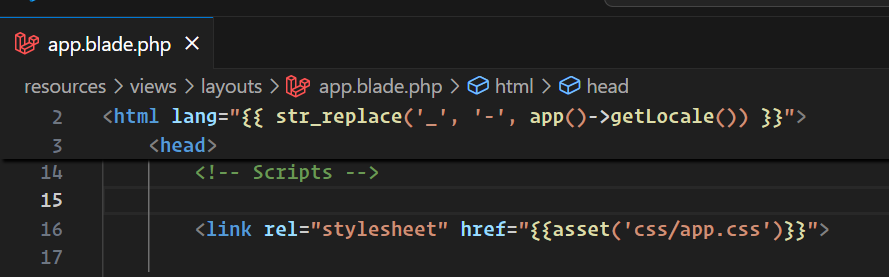
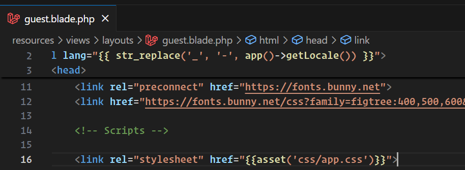
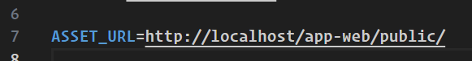

## Comandos para instalar Breeze
 composer require laravel/breeze --dev
 
 php artisan breeze:install

Configurar el app.blade.php y guest.blade.php

## Configurar el .env con ASSET_URL (va la ruta local de su servidor)
Ejemplo:

